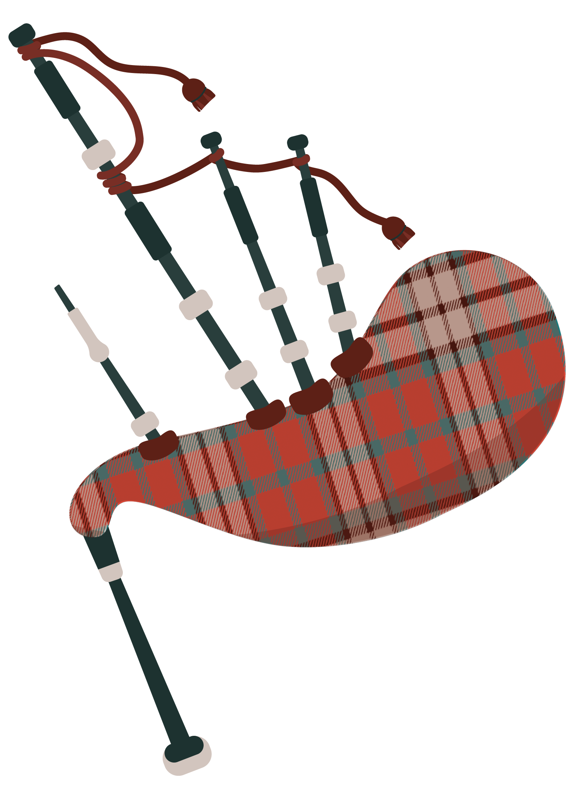
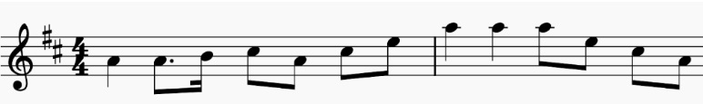
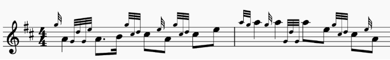
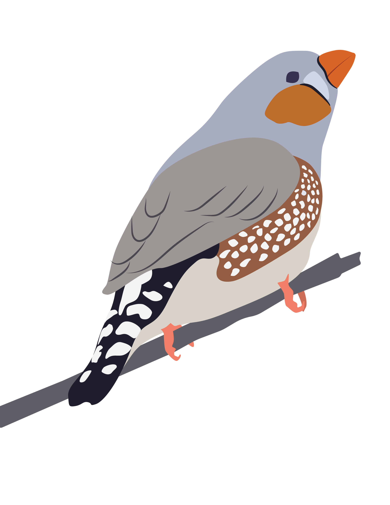
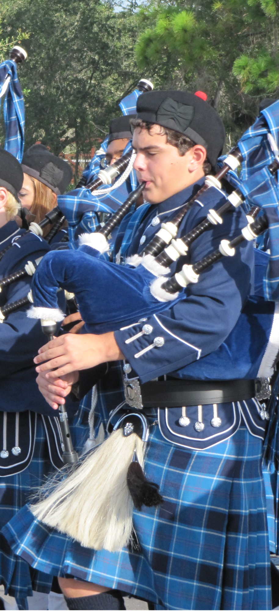

Without a doubt, you've heard a bird sing before. It's a little less likely that
you've heard bagpipes. Birdsong is the voice of nature, the beautiful melodies
that poets and composers have attempted to capture over the centuries. Bagpipes
are often avoided, and were classified as a weapon of war in 1700s England,
which is a bit of an overreaction in my opinion. I played bagpipes all through
high school, and my current career is the scientific study of birdsong learning
and perception. Turns out, there are more similarities than you might think.

::: {style="float: right; margin: 5px;"}
{width=300px}
:::

Bagpipes are not an indoor instrument. They can (and perhaps should) be heard
from far away because of how loud they can get. Birds are also quite loud; their
mating songs, alarm calls, and territorial claims are more effective if they can
project over a large distance. The early morning "dawn chorus" of songbirds is
actually a competitive battlefield of mating calls that can reach a volume of
100 decibels (dB), as loud as one bagpipe player. Audiologists advise that
prolonged exposure to sound louder than 85 dB can cause hearing loss. You might
think "that's not too bad, it's only 20% louder", but decibels are a logarithmic
unit of measurement. Every 6 dB increase doubles the air pressure hitting your
eardrums, so a jump from 85 to 100 dB is way, way more pressure.

Not only are bagpipes loud, they're also pretty simple. You blow air into a bag,
and that air rushes through drones that produce a long, never-ending tone in
multiple octaves, a music term called harmonics. Air also vibrates a wooden reed
that plays one of nine notes at 100 dB. That's right, bagpipes can only play
nine notes. G-A-B-C-D-E-F-G-A. It's a huge limitation of the instrument, as
you're stuck playing in one key and every other musician has to change their
tuning if they want to harmonize with bagpipes.

Birds also have a limited musical repertoire. Don't get me wrong, birds are
amazing, complicated creatures, with over 11,000 species that thrive on every
continent on the planet. In my research, we study "song", the learned courtship
song of a (usually) male bird. Chickens and owls don't sing; nightingales,
finches, and robins love singing. When I put a finch in a sound booth, they can
sing their one mating song hundreds of times in an hour. That's right, finches
only learn a single song. This 1-2 second vocalization is the difference between
mating and dying alone. It can be fewer than nine "notes", and yet finches use
it to recognize individuals, and they can tell if a song is good or bad.

So how can a nine-note bagpipe and a one-song bird make beautiful music?
"Scotland the Brave" is one of the most famous bagpiping tunes, and you don't
need to know music theory to notice the simple melody of single notes:

::: {.flex-container .align-center width='60%'}

:::

The notes go up, they come back down, it sounds great! Except, this is not what
bagpipes actually sound like. The difficulty of bagpipes (besides constant
breathing to inflate the bag) comes in the embellishments. There is an entire
vocabulary of ornaments that require fast and precise hand movements. The actual
sheet music for "Scotland the Brave" looks something like this:

::: {.flex-container .align-center width='60%'}

:::

Now you can start to appreciate what bagpipes have to offer. Put your bagpiper
on a nearby hill, and the harmonic drones underlie all these fast grace notes
and embellishments. You might be wondering if birds have embellishments, well
see for yourself! (Don't worry I'll explain what this is).

::: {.flex-container .align-center width='100%'}

:::

Above is a spectrogram of the zebra finch song, a sort of "science sheet music"
for looking at sounds and speech. The stacked color lines are a single "note"
that has harmonics in multiple octaves, just like the bagpipe drones! What looks
like a smear in the spectrogram is a slide between two notes. Listen to this
zebra finch's song at full speed, and at 50% speed. Even when slowed down, it
can be tough for our human ears to appreciate how fast this zebra finch is
changing notes.

::: {.flex-container .align-center id="birdsong-recording"}



:::

Finches learn their song from an adult tutor; young finches memorize and modify
this tutor song over the next few months during a "critical period" of learning.
They must be able to hear themselves (auditory feedback) in order to improve the
song. Learning the bagpipes obviously takes practice and feedback, but the only
reason my school had bagpipes to begin with was because our band director taught
us. He in turn was taught how to play bagpipes by a large, blunt Scottish man
who was a pillar of the community. Our marching band was not the best sounding,
or the most coordinated, but having that unique bagpipe factor let us play
parades at Universal Studios, Disney World, and Boston's St. Patrick's Day. Our
bagpipes could only play nine notes, but that didn't stop us from learning
original arrangements of Thriller (Michael Jackson), We're Not Gonna Take it
(Twisted Sister), and Fat Bottomed Girls (Queen).

Finches use their unique song as an honest signal of evolutionary fitness.
"Honest signal" means that the finches that sing better are healthier, better
mates, and better fathers to their offspring. A huge part of birdsong science is
analyzing those smeared squiggly spectrograms and asking "is this… sexy?" Are
these notes, sung at this speed, at this timing, localized entirely within one
bird, something a potential mate likes? Recent research has used machine
learning to look at millions of birdsong snippets, trying to identify what tiny
embellishments and changes over time predict that a song will attract a mate
[@alam_hidden_2024]. Because a bird's courtship song is
so important, the process of learning song is also important. It's a similar
process to how human babies learn their first language. Here are some
highlights:

::: {style="float: left; margin: 5px;"}
{width=300px}
:::

- Finches that don't learn a song still try to sing. What they sing does not
  attract mates. [@alam_hidden_2024]
- Finches sound like their tutor, even if their tutor is not their biological
  father, and even if that tutor is a different species of finch! [@moore_emergent_2019]
- Individual neurons in the auditory cortex (L3 and NC) are tuned by learning.
  Those neurons in a zebra finch will respond more to Bengalese finch song if
  that zebra finch was tutored by a Bengalese finch. [@moore_emergent_2019]
- Finches have a specialized brain circuit for the motor production of song, and
  a dopamine signaling pathway that is necessary for song learning. [@kasdin_natural_2025]

Birds and humans are separated by 300 million years of evolution. Vocal learning
(be it song or language learning) is common in birds and extremely rare in
mammals, so are there similarities? Dopamine guided learning
[@kasdin_natural_2025] and the function of inhibitory
neurons [@ordiway_translational_2025] are promising fields of
research, but those are two small pieces of a very large jigsaw puzzle. Also, we
may find out that vocal learning in birds is like a jigsaw puzzle, and human
vocal learning is like a Rubik's Cube where every square is a different jigsaw
puzzle.

I mentioned before that finches are not the only birds that learn songs.
Mockingbirds learn hundreds of songs, but trying to scientifically understand
that learning process would be a hundred times more difficult. I study finches
because their natural behaviors like song can be studied in the laboratory.
Whales also learn songs, but good luck trying to study that (seriously, good
luck. Some very dedicated researchers study vocal learning in whales). Finches
are a powerful model in science not despite their limitations, but because of
them. With finches, we can study important scientific questions about auditory
learning and the development of a learned vocalization.

Bagpipes may not be able to play every song, but the story they can tell is no
less beautiful. Bagpipes and finches both execute tiny, rapid changes that
highlight individuality. Subtle variations on a common theme, with ample
reference to whoever tutored you. A learned skill that easily outshines someone
who never learns in the first place. A requirement for getting a mate… is where
the similarities end.

Limitations are not just for the birds and the bagpipes. We study animals
because we can access the brain in ways that are not possible with humans. There
are limitations in how we gather data. If we record from individual neurons, we
miss out on how large regions of the brain function. Magnetic Resonance Imaging
(MRI) scans the entire brain, but takes an image every 20-50 milliseconds, too
slow to capture neuron activity.

"The enemy of art is the absence of limitations" -- Orson Welles.
I'd argue the same goes for science. As scientists, we do the best we can with
what we have. The first genetic sequencing of the human genome took 13 years to
complete. Now it can be done in 4 hours, but only because of that existing body
of difficult-to-perform research. The limitations to fully understanding the
brains of humans and animals help guide our research questions.

Even my career in science was guided by limitations. In college I wanted to
study music and the brain, but the largest model organism in my Biology
department was a zebrafish. Turns out, you can assess their behavior using
sound! I limited my graduate school applications to programs in auditory
neuroscience, and joined Northwestern's department of Communication Sciences and
Disorders. I studied embryonic chickens because their auditory development
occurs inside the egg, in contrast to mice which are deaf for two weeks after
birth. Because my PhD was in birds, I chose to study birdsong perception for my
postdoc.

Whatever I end up doing in the future, I won't say my options are unlimited,
because that isn't true (It would also defeat the whole purpose of this
article). No matter what, studying birdsong and playing the bagpipes are equally
good conversation starters. If any of you are interested in studying bagpipes,
birdsong, or any kind of science, I have two pieces of advice. Find yourself a
good tutor, and don't forget to go outside.

::: {.callout-note title="About the author" style="" icon=false}
George is a postdoctoral research scientist in Dr. Sarah Woolley's lab at
Columbia's Zuckerman Institute. When not studying songbirds, George enjoys
singing in choir and running. On less active days, he enjoys video games, anime,
and Dungeons and Dragons.

[](https://bsky.app/profile/georgeordiway.bsky.social)
[](https://www.facebook.com/george.ordiway/)
:::

::: {.flex-container .align-center}
{width=30.5%}
{width=50%}

Left: George playing bagpipes in his school's Pipe and Drum Corps in
2011. Right: "Jazz, Birds, and the Brain", part of the Music on the Brain
collaboration with the National Jazz Museum in Harlem and Columbia's Zuckerman
Institute in 2025.
:::
