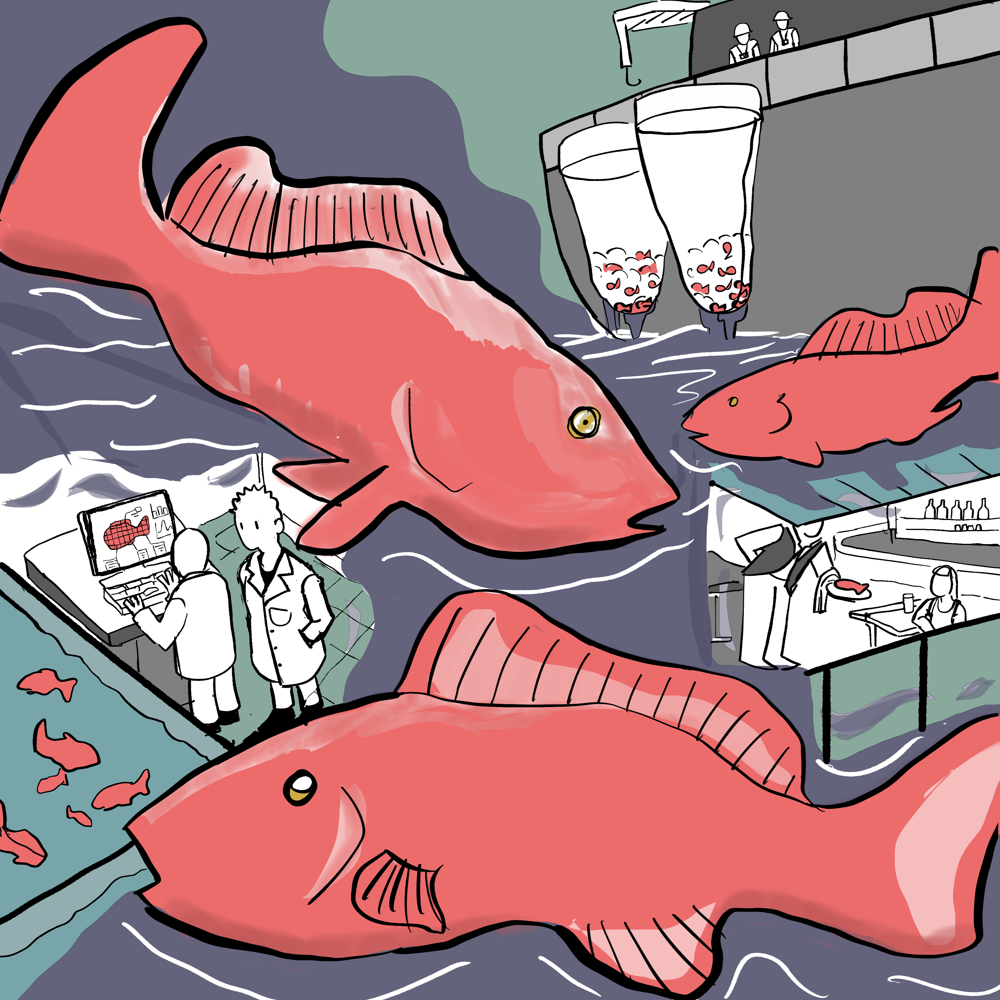
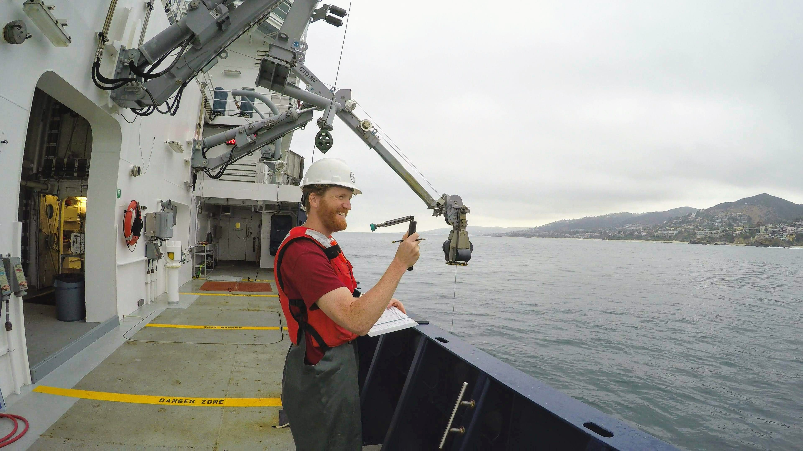
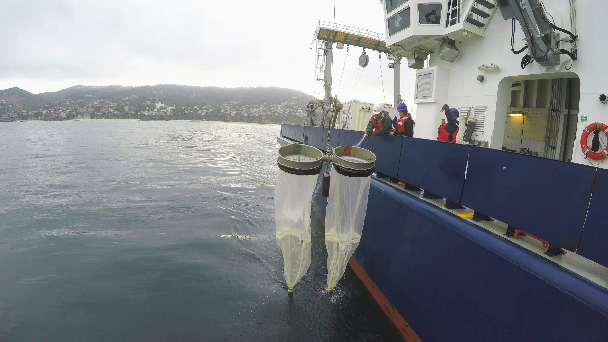
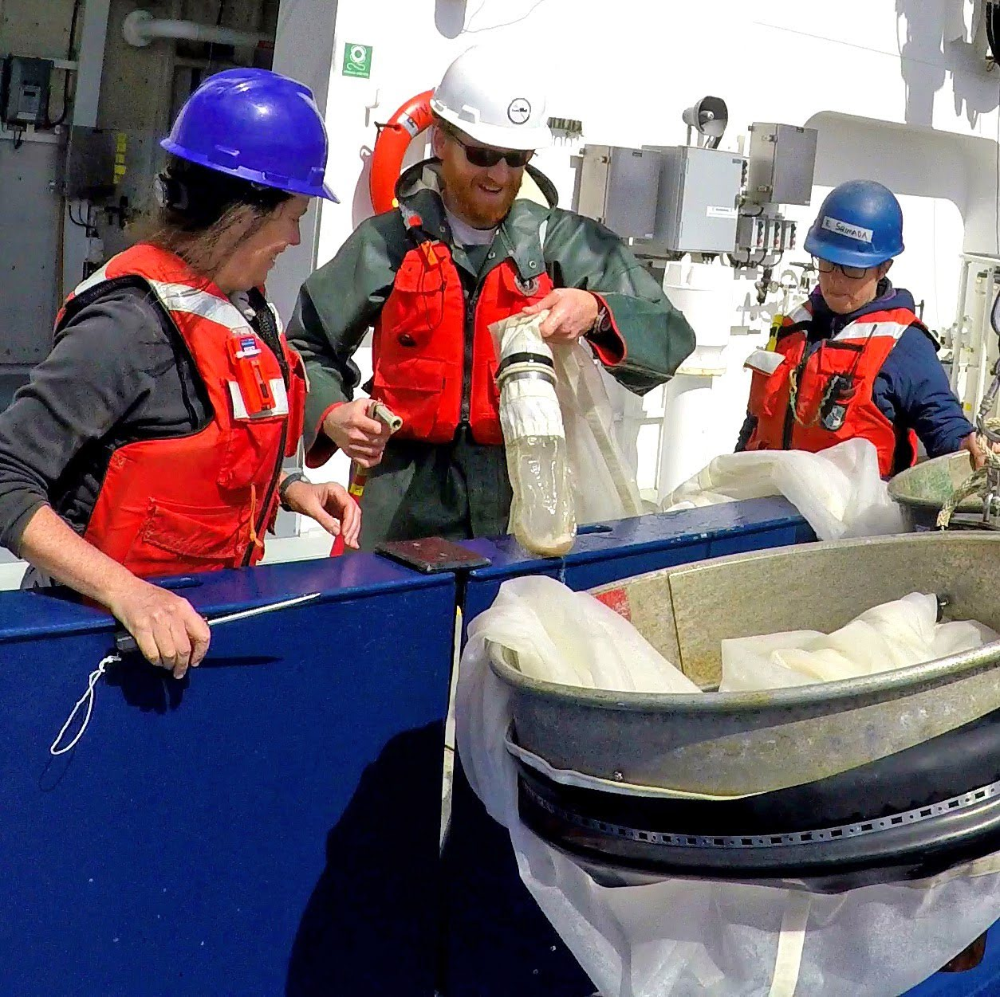
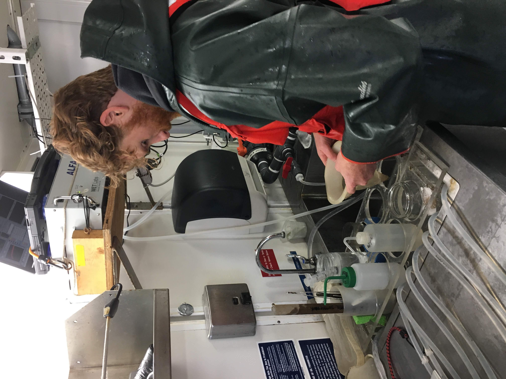
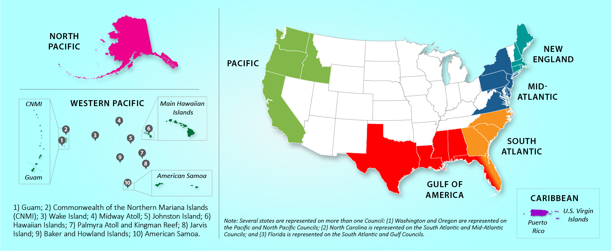
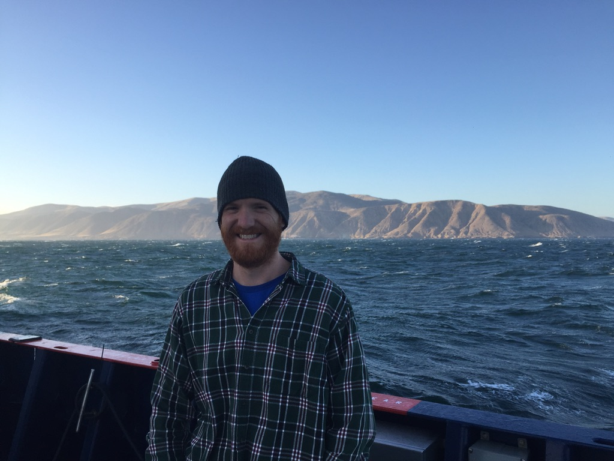

When meeting new people and the inevitable question of "What do you do?" arises.
I used to say "I'm a marine biologist." People naturally assumed I trained
dolphins or went scuba diving every day, neither of which is true. I have
recently described myself as a fisheries biologist, which is more accurate and
makes for better conversation. Most people have an idea of what a biologist is
(mucking through forests looking for critters or in a lab coat with a trusty
pipette), but what is a _fisheries_ biologist?

## What is a fishery?

When I use the word "fishery," remember it refers to wild-caught seafood
(freshwater and marine, but I specialize in marine); think fish, shrimp, crab,
lobster, oysters, and so forth. A fishery includes everything about the species
that is caught, from basic biology to their habitat, how and where the species
was caught, who catches them, and what laws regulate fishing. So a fisheries
biologist is someone who studies the biology, ecology, and methods of capture of
animals that are caught and sold as seafood. Fishery becomes plural because we
tend to study more than one fishery as a part of being a _fisheries_ biologist.

## What does a fisheries biologist study?

A fisheries biologist studies the biology and ecology of the organism that is
caught by fishermen. A fisheries biologist, however, also does many things that
may be outside of what is thought of as straightforward biology. For example, I
have studied red grouper or _Epinephelus morio_. Red grouper is a popular fish
that lives around Florida and up to North Carolina. It is a common menu item in
beachside restaurants in the Southeastern US -- just look for the grouper
sandwich. A fisheries biologist wants to know all about this species. How fast
does it grow? How big does it get? Where do they live? What do they eat, or who
eats them? We also want to know how many eggs a female can make, when they
spawn, and where the juveniles grow up (not with the parents). There are other
things a fisheries biologist might want to know that aren't usually considered
biology. For example, how, when, and where fishermen catch red grouper, how laws
impact the fishermen, or how fishing affects red grouper biology. One of the
more interesting topics about red groupers is that they are sensitive to harmful
algal blooms. These blooms produce a toxin that kills these groupers, which is a
problem. Studying this issue has led me to try to understand the oceanography,
land use policies, and water quality issues that influence these blooms. Ok, so
fisheries biologists want to know a lot about many fish-related (or shrimp or
crab or insert your favorite wild-caught seafood) topics, but what do we
actually do?

::: {.flex-container .align-center}
{width=750px}
:::

## What do fisheries biologists do?

Simply put, we ask questions, plan research projects,collect data, analyze it,
present the results, then repeat. Most fisheries research takes an army of field
biologists, laboratory scientists, and computer modelers to do all the stuff
fisheries biologists do. Broadly, the data we use to answer our questions comes
in two flavors: fisheries-dependent and fisheries-independent. Looking at these
types of data should help you to understand what fisheries biologists do.

Fisheries-dependent data comes from directly interacting with fishermen and the
fishery. For example some of the data include, how many pounds of fish were
caught, when and where the fish were sold, and how much money the fishermen made
from the catch. Other fisheries-dependent data come from biologists who meet a
fishing boat at the dock to measure and weigh fish at the end of a fishing trip.
These biologists, called port agents, may collect fish ear bones called
otoliths, used to tell how old the fish were, and take reproductive organs, or
DNA samples for genetic analyses. There are also fisheries observers who work on
fishing boats to see which species were caught, and how long and how heavy the
catch was. Observers also want to know what fishing gear was used, what bait was
used, and where the fishing happened. I did this in the Gulf of Mexico and the
Southeastern US for almost 6 years. It was a great experience, but it is also
not for everyone. A fisheries observer is on a fishing boat for days to weeks at
a time (sometimes months, depending on the region and fishery). Observers work
long and odd hours, as some fishing boats work 24 hours non-stop, day or night.
The weather and sea can be unpredictable or hazardous. Fishing boats can be
cramped, and there is little privacy. For the most part, the fishermen are
friendly and willing to help, but some view taking observers as a burden. I
learned fishermen were happier with me on board when I helped out with cooking
and cleaning as much as possible without ignoring my own job. I also learned
about conflict resolution because everyone is literally on the same boat with
nowhere to go (I could write a whole series just on being a fisheries observer).

::: {layout-ncol=2}

:::

:::: {layout-ncol=2}
{width=100%}

{width=75%}
::::

The other flavor of fisheries data is fisheries-independent. The data can come
from scientific surveys on research ships that catch marine animals with nets or
hooks similar to gear used on fishing boats. Fisheries-independent data can also
come from underwater cameras and, yes, scuba diving. Some scientists bring live
animals into their laboratories for experiments. These scientists grow or breed
the animals in giant aquariums collecting vital biological data used in computer
models. Other fishery biologists use microscopes to count the rings in fish ear
bones to see how old they are, similar to counting tree rings. Other scientists
look at fish guts to see if they are mature or have spawned recently or will
spawn soon, or to see what these fish ate. To my laboratory comrades, forgive
me, I know I have simplified a lot, and this part is integral to fisheries
biology, but I am a field biologist.

## Why is Fisheries Biology Important

My goal has been to introduce you to fisheries biology, though there is so much
more depth to the topic. My task is not complete without explaining the
importance of this work. Fisheries biology is applied to the need of managing
our shared living marine resources. US fisheries are required by the
Magnuson-Stevens Fishery Conservation and Management Act to be managed using
what is legally defined as the "best scientific information available". This
term acknowledges that all fisheries are different, ecosystems are complex, and
there will always be uncertainty in scientific results (this uncertainty can be
unsettling but it is a reality in all science and is part of making observations
and performing statistical analyses). Moreover, guidelines such as peer review
of scientific results and integrating public input are required to determine the
"best scientific information available". The data collection described above is
used for exactly that purpose. Much of the data are used in computer models that
simulate a population in a fishery. The models calculate population size and
give an estimate of the amount of fish that can be caught without hurting the
ability of the population to reproduce itself year after year. The computer
modeling is part of a process referred to as a stock assessment. The results of
the model are then reviewed by fishermen and scientists not involved in the
stock assessment to see if they make real-world sense. The results are then
debated by regional fishery management councils before fishing regulations are
updated or changed. The US has eight regional fishery management councils with
representatives from the states in the region. The duty of the councils is to
decide how best to manage the fishery based on science and public input. These
last steps are crucial and sometimes require what are referred to as "fish
politics" to ensure that the science is used accurately and to the fullest
extent reasonable.

::: {.flex-container .align-center}

:::

The US has some of the most sustainable fisheries in the world, and this is not
possible without investment in good science and strong laws. Trust between
fishermen, scientists, and managers is also important in successful fisheries
management. I have focused on the US federal fisheries in this article; however,
similar science and management are common in many US states and in other
countries around the world. Fisheries biologists are needed for fisheries
management to work in the US. Fisheries biology is a wonderfully diverse field
in which research can be applied to fishery management decisions. The field can
be incredibly disappointing and satisfying (sometimes on the same day because
problems and setbacks are a rule rather than an exception during field work).

::: {.flex-container .align-center}
{width=70%}
:::

## So long and thanks for all the fish

Now that you have a better understanding of what a fishery biologist is and what
we do, I hope that you have a better appreciation for seafood. We are just part
of what gets that fish to your plate; the other part, the harder part, requires
the hardy fisherman and fisherwoman (let's not forget their indispensable role
in all this). Finally, I hope you can now appreciate that marine biology as a
field contains multitudes and one of them is a fishery biologist.

::: {.callout-note title="About the author" style="" icon=false}
Brendan is a research scientist working at the Cooperative Institute for Marine
and Atmospheric Studies, University of Miami and affiliated with NOAA Southeast
Fisheries Science Center. He is also the co-leader of NOAA's
[Gulf of Mexico Integrated Ecosystem Assessment Program](https://www.integratedecosystemassessment.noaa.gov/regions/gulf-mexico).
His research spans a wide range of topics referred to as the triple bottom line
of fisheries that includes the biological, economic, and social dimensions of
fisheries; however, his formal training was biologically focused. Brendan is
also an adjunct professor teaching comparative physiology and ecology. In his
free time you can find him cooking, building something usually for his backyard
chickens, or generally enjoying the outdoors.

[](https://bsky.app/profile/crabtails.bsky.social)
[](https://www.linkedin.com/in/brendan-d-turley/)
[](https://github.com/BrendanTurley-NOAA)
:::

::: {.flex-container .align-center}
{width=50%}
:::
