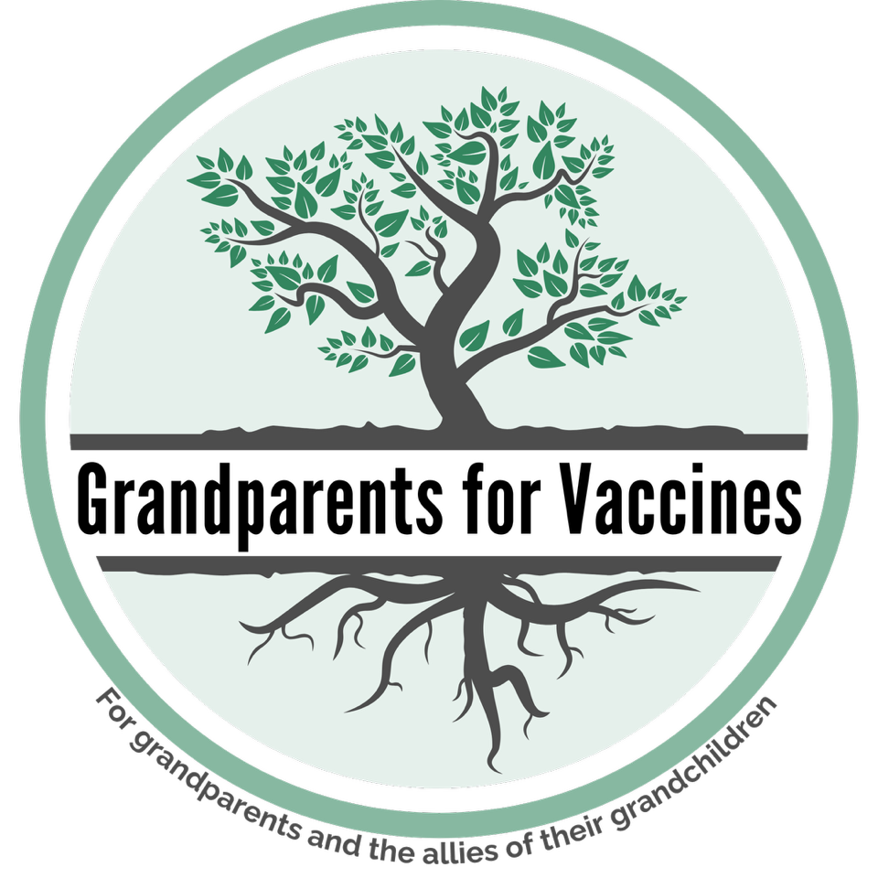

My first grandchild, Sam, was born last August. He's seven months old now and
growing fast. I love that little guy. There's so much I want for him, including
good health and freedom from infectious diseases. That's why I joined the group
Grandparents For Vaccines
([grandparentsforvaccines.org](https://grandparentsforvaccines.org/)), a
volunteer-led movement whose mission is to ensure America's grandchildren have
the best start in life without the threat of vaccine-preventable diseases.

When I worked as a scientist at the National Institutes of Health, I studied how
electric and magnetic fields interact with our bodies, a topic full of false
claims that are not supported by the evidence, such as cell phones cause brain
cancer. Now, I find a similar situation with vaccines, where misinformation is
widespread. Many
[myths](https://www.aaaai.org/tools-for-the-public/conditions-library/allergies/vaccine-myth-fact)
about vaccines are untrue, such as allegations that they contain toxic
ingredients, cause autism, overload the immune system, and are not tested before
approval. As a scientist, I know there is overwhelming evidence that vaccines
are safe. You can learn more about the science behind vaccines from the _Your
Neighborhood Scientist_ article ["Vax to the Future: Building a Healthier
Tomorrow With Vaccines" by Alyssa
Maturen-Backlas](https://neighborhoodscientist.org/posts/2025/building-healthier-tomorrow-vaccines/).

Today, I speak as a grandfather as well as a scientist. In some ways, vaccines
are victims of their own success. Diseases like whooping cough, diphtheria, and
the mumps are so rare today that people don't realize what life was like before
vaccines were common. But grandparents remember. Grandparents, and especially
great-grandparents, grew up before many vaccines were common. They know the pain
and suffering caused by infectious diseases. They have important stories to
tell.

Let me give you some examples. Jan from Washington recounts how she lost her
twin brother Frankie to polio in 1953, just two years before Jonas Salk's polio
vaccine was approved. Jan also got polio, but survived after a harrowing ordeal.
She says "we cannot go back to those bad old days."



Children's book author Roald Dahl lost his beloved seven-year-old daughter
Olivia to the measles in 1962. You can listen to his words as he writes of his
devastation. Dahl dedicated his book _The BFG_ to Olivia's memory after her
death. He says "I know how happy she would be if only she could know that her
death had helped to save a good deal of illness and death among other children."

```{=html}
<!-- custom iframe for YouTube Short format -->
<div style="text-align:center;">
  <iframe width="315" height="560"
  src="https://www.youtube.com/embed/7EDZ1RC6Uhg"
  frameborder="0"
  allowfullscreen></iframe>
</div>
```

Andy and Ginny from Minnesota describe Andy's battle with meningitis in college,
before the current vaccine was available. He survived, but only after gruesome
amputations of all but one of his fingers and toes, and months of
rehabilitation. Andy says that "every child should receive the shot... meningitis
is just too dangerous and too fast moving to overlook."



You can hear dozens of other stories on the [Grandparents for Vaccines YouTube
station](https://www.youtube.com/@GrandparentsforVaccines). All these stories
illustrate the terrible suffering associated with what are now
vaccine-preventable diseases. Children no longer need to fear polio, measles,
and meningitis, if their parents have them vaccinated.

Let me close with a request. I expect some readers of Your Neighborhood
Scientist want to contribute to and advocate for science and public health, but
don't know how. Here are four suggestions:

- Follow Grandparents For Vaccines on [Facebook](https://www.facebook.com/profile.php?id=61576610811699), [Instagram](https://www.instagram.com/grandparentsforvaccines/), [Tiktok](https://www.tiktok.com/@grandparentsforvaccines/video/7615041592377822495), and other social media. Help us get the word out.
- Listen to the videos, learn what life was like before vaccines, and talk about what you learned with others. Advocate for vaccines.
- If you lived back in the time before vaccines and witnessed the damage these horrendous diseases caused, consider telling your story to Grandparents For Vaccines. Make your own video.
- If you have the time and interest, become a state rep for Grandparents For Vaccines. They are recruiting reps for each state, and even each media market, who can promote vaccines by speaking at events, writing letters to the editor in local newspapers, and telling their stories publicly.

Your experience is so important to children like my grandson Sam and others of
his generation. Your story may be the one to convince a young mother to
vaccinate her kids. You may save a life.

<hr>

::: {.flex-container .align-center}
{width=90%}
:::

::: {.callout-note title="About the author" style="" icon=false}
Brad Roth is a former NIH scientist who taught physics at Oakland University in
Rochester, Michigan for 22 years. He is a coauthor of the textbook _Intermediate
Physics for Medicine and Biology_ and wrote the popular science book _Are
Electromagnetic Fields Making Me Ill?_ He is now the Michigan representative for
Grandparents For Vaccines. If you have any questions about how to submit a story
to Grandparents For Vaccines, feel free to contact Brad at
[roth@oakland.edu](mailto:roth@oakland.edu) or email
[grandparentsforvaccines@gmail.com](mailto:grandparentsforvaccines@gmail.com).
:::

:::{.flex-container .align-center}
[](https://www.youtube.com/@GrandparentsforVaccines)
[](https://www.facebook.com/profile.php?id=61576610811699)
[](https://www.instagram.com/grandparentsforvaccines)
[](https://www.tiktok.com/@grandparentsforvaccines/)
[](https://www.linkedin.com/company/grandparents-for-vaccines)
[](https://grandparentsforvaccines.org/)
[](mailto:grandparentsforvaccines@gmail.com)

[{width=70%}](https://grandparentsforvaccines.org/)
:::
