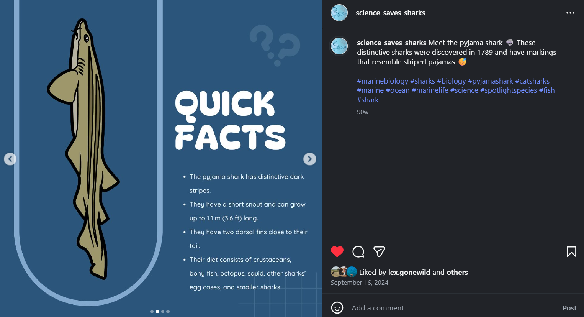
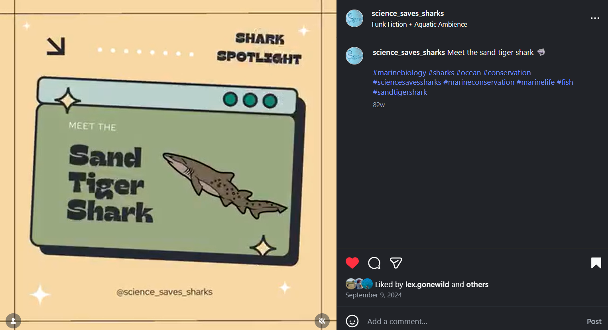
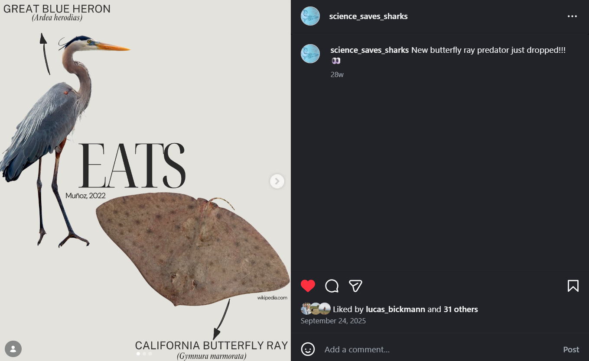

For most people, sharks and rays are often introduced through movies like Jaws,
television events such as Shark Week, or viral social media content. These
portrayals often focus on danger, negative experiences, or a handful of famous
"apex" species. How did you first feel when you heard the _Jaws_ theme song or
saw the film? While this type of media can spark viewership, it can also promote
fear or overlook other marine life. I work as a digital content manager with
Science Saves Sharks
([@science_saves_sharks](https://www.instagram.com/science_saves_sharks/)), a
conservation organization based in South Africa that focuses on raising
awareness and building connections between people and sharks and rays. The
organization uses digital storytelling and accessible science communication to
reach a global audience, making social media a key tool in its outreach efforts.
I am also pursuing a Master's in Biology through Project Dragonfly at Miami
University. Through this work, I wanted to explore whether social media could
tell a different story, one that encourages conservation and builds positive
connections rather than fear-driven narratives.

Through two projects utilizing Instagram campaigns,
[Sharkstagram](https://docs.google.com/document/d/1pSqqdLNmzgwRjzKZzm60LJqP3sfgIX70z0ztspEKdfA/edit?usp=drive_link)
and
[Raystagram](https://docs.google.com/document/d/1VAFuTyQ7SShlNuYI1YxTsG8y_lAuuRRdSzzHHYM-Ec0/edit?usp=drive_link),
I analyzed how social media can help people connect with underrepresented marine
species and why those species matter for ocean conservation.

Social media has become a useful tool for sharing scientific information with
the public. Unlike traditional communication platforms, such as academic
journals, platforms like Instagram allow scientists to reach audiences who may
not regularly engage with scientific journals or environmental organizations.
Instead of reading information, audiences can interact by asking questions,
participating in quizzes, and engaging with content. This type of participatory
communication can make conservation feel more personal and accessible.

However, social posts can often focus on charismatic species or species that are
popular. These are animals that people are already familiar with, like great
white sharks or tiger sharks. While attention can benefit those species, it can
leave others overlooked. After noticing this pattern on my own socials, it
inspired me to begin these projects.

My first project, Sharkstagram, explored whether audiences are more interested
in well-known or lesser-known shark species. I created a series of educational
Instagram posts comparing well-known sharks, including great white sharks and
hammerheads, with lesser-known species such as pyjama sharks and ghost sharks.
Each week featured a species spotlight, followed by interactive quizzes to test
whether our audience was learning from the posts.

::: {.flex-container .align-center}
{width=100%}
:::

I expected well-known sharks to receive more engagement because they are widely
featured in the media and are usually more recognizable. Instead, the results
showed that lesser-known shark species received slightly higher engagement in
both views and likes. Quiz participation also remained steady across species,
suggesting that audiences were just as willing to learn about unfamiliar sharks
as they were about famous ones.

::: {.flex-container .align-center}
{width=100%}
:::

Building off of this project, I launched a second campaign called Raystagram.
This six-week project focused on rays and examined whether hashtag popularity
influenced audience engagement. I compared species associated with widely used
hashtags, such as oceanic manta rays and spotted eagle rays, with species that
had less hashtag usage on Instagram, including electric rays and guitarfish.

Each week followed a consistent posting schedule that included educational
posts, short videos using trending audio, scientific paper summaries and
interactive quizzes. This allowed me to collect more engagement data on
different style posts and allowed the rest of the Science Saves Sharks team to
participate.

The results showed no significant difference in engagement between species with
frequently used hashtags and those with less frequently used tags. However, the
campaign still produced meaningful growth for Science Saves Sharks social media
presence. Over six weeks, the Science Saves Sharks Instagram account reached
approximately 5,300 new viewers and gained 40 followers. Engagement increased
throughout the campaign, suggesting that consistent posting and various forms of
content may be more important than hashtag popularity alone. In our comments, we
at times received questions, but we also had our post sharing increase. I
hypothesize this could be due to the resources we also share for our posts that
are linked on stories or put in as QR codes.

::: {.flex-container .align-center}
{width=100%}
:::

Moving forward, I plan to expand these efforts by exploring themed awareness
campaigns and testing a bracket-style competition campaign to celebrate Ocean
Month this coming June. Campaigns like Shark Week or viral online movements such
as Team Trees show how powerful digital media can be in getting people to care
and take action. Every post, share, and hashtag contributes to which species
receive attention and support.

Conservation begins with connection. If social media can help people see sharks
and rays as more than headlines or stereotypes, it can become a powerful tool
for protecting the ocean's marine life.

::: {.callout-note title="About the author" style="" icon=false}
Alexa Tedeschi is a science communicator and conservation marketing professional
currently earning a master's degree in Biology through Miami University's
Project Dragonfly program. She specializes in using digital media, storytelling,
and community engagement to connect people with conservation. Her work has
supported organizations focused on wildlife conservation, sustainable
agriculture, and environmental education through strategic communications,
social media campaigns, and public outreach.

[ @science_saves_sharks](https://www.instagram.com/science_saves_sharks/)
[ @lex.gonewild](https://www.instagram.com/lex.gonewild/)
:::
